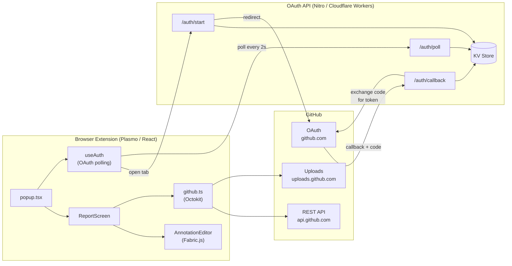

# GitHub Issue Reporter

A browser extension that lets users report GitHub issues directly from any webpage — without leaving the browser. Captures the current URL, browser context, and optional annotated screenshots, and files a GitHub issue in one click.

## Packages

This is a pnpm monorepo with three packages:

| Package | Description |
|---------|-------------|
| [`packages/extension`](./packages/extension) | Browser extension (Chrome MV3 / Firefox MV2) |
| [`packages/api`](./packages/api) | OAuth backend deployed on Cloudflare Workers |
| [`packages/shared`](./packages/shared) | Shared TypeScript types and Zod schemas |

## Architecture



**Why a separate API?** Browser extensions cannot safely store OAuth client secrets. The API acts as a confidential OAuth client: it holds the secret, exchanges the authorization code for a token, and makes the token available to the extension via a short-lived polling endpoint.

## Prerequisites

- Node.js ≥ 20
- pnpm ≥ 9
- A GitHub OAuth App (see [API setup](./packages/api/README.md))

## Local development

```bash
# Install all dependencies
pnpm install

# Start the OAuth API (terminal 1)
pnpm dev:api

# Start the extension in watch mode (terminal 2)
pnpm dev:extension
```

The extension dev server opens a browser with the extension loaded. The API runs on `http://localhost:3001` by default.

See the individual package READMEs for full setup steps, including environment variables:
- [Extension setup](./packages/extension/README.md)
- [API setup](./packages/api/README.md)

## Building

```bash
# Build all packages
pnpm build

# Build only the extension (Chrome)
pnpm --filter @github-issue-reporter/extension build

# Build only the extension (Firefox)
pnpm --filter @github-issue-reporter/extension build -- --target=firefox-mv2

# Build only the API (for Cloudflare Workers)
pnpm --filter @github-issue-reporter/api build
```

## Type checking

```bash
pnpm typecheck
```

## CI

GitHub Actions runs on every push to `main` and on pull requests:

| Job | What it does |
|-----|-------------|
| `typecheck` | Runs `tsc --noEmit` across all packages |
| `build-api` | Builds the Nitro API for the `node-server` preset |
| `build-extension` | Builds and packages Chrome + Firefox extensions, uploads ZIPs as workflow artifacts |
| `release` | *(main only)* Creates/updates the rolling `latest` pre-release on GitHub Releases |
| `publish-chrome` | *(main only, opt-in)* Uploads to Chrome Web Store — enable by setting `CWS_PUBLISH=true` and the four CWS secrets |

## Deployment

| Package | Target | Guide |
|---------|--------|-------|
| `packages/api` | Cloudflare Workers | [API deployment](./packages/api/README.md#deployment) |
| `packages/extension` | GitHub Releases / Chrome Web Store | [Extension deployment](./packages/extension/README.md#deployment) |

## Decision log

Key architectural decisions are documented in [`docs/decision-log/`](./docs/decision-log/).
